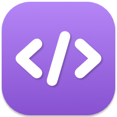
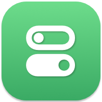
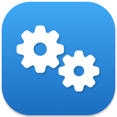
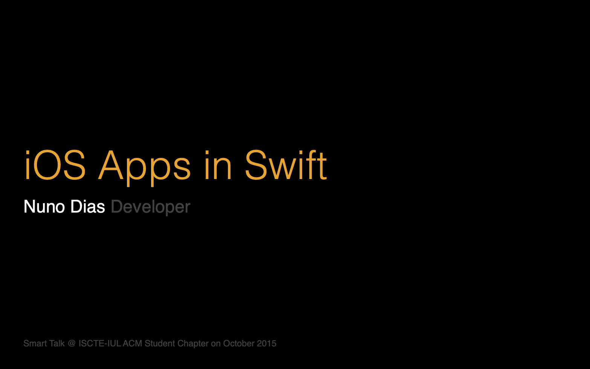

These are my **open source projects**. I also built some apps over the, check them out **[here](/apps/)**.

  
  

    
XMLKit

    
Codable XML , Reader and Writer.

  

> XMLKit is a Swift library for XML parsing, encoding and decoding of Codable types in a robust and type-safe manner using Swift's Coding practices.
>   
> Currently in private development, it's partially embedded in <a href="https://github.com/nmdias/FeedKit" target="_blank" rel="noopener">FeedKit</a>, and should be released as an standalone library once it’s more mature.

  
  

    
FeedKit

    
Universal Feed Reader and Generator.

  

>
> A Swift library for Reading and Generating RSS, Atom, and JSON feeds, for all Apple platforms and Linux.  
>
> 

  
  

    
DefaultsKit

    
UserDefaults for iOS, macOS and tvOS.

  

> An open source framework that leverages Swift’s Codable capabilities to provide a **Strongly Typed wrapper, on top of UserDefaults**, for iOS, macOS and tvOS.  
>   
>
> 

  
  

    
InfoKit

    
Strongly Typed access to the Info.plist

  

> An open source framework that provides **Strongly Typed** access to the **Info.plist**, for iOS, macOS and tvOS.  
>   
> 

<!-- ## iOS Apps in Swift

> **Keynote speaker** for the **Smart Talks initiative at ISCTE**, University Institute of Lisbon.  

 -->